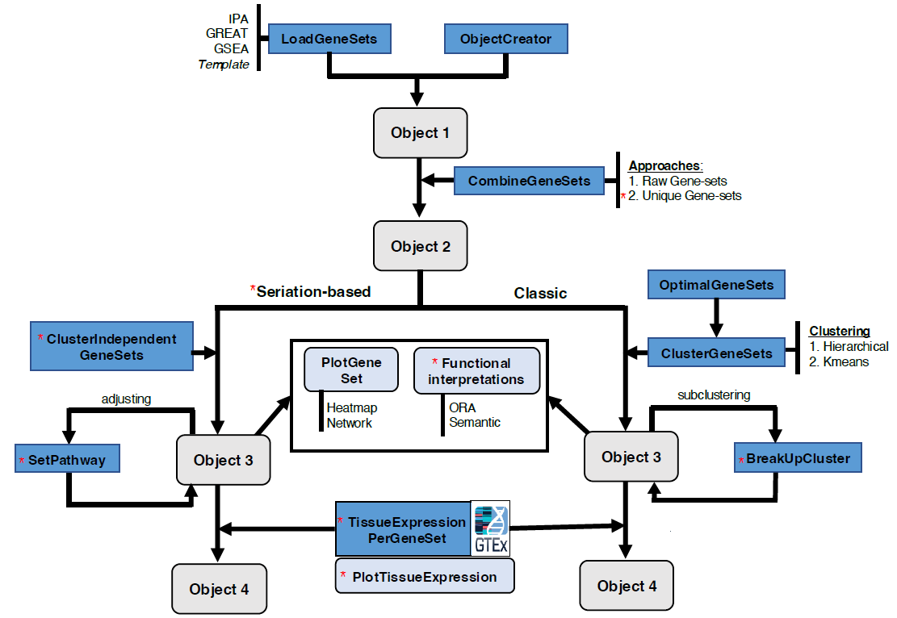

# GeneSetCluster 2.0 

This repository contains the code and data of the R-based tool GeneSetCluster2.0 for summarizing and integrating results from gene-set analyses (GSA). For further details, we recommend you read the corresponding articles.
* [Summary](#summary)
* [Installation](#installation)
* [Examples](#examples)
* [Quick start](#quick-start)
* [Resources and Documentation](#resources-and-documentation)

## Summary

A new version 2.0, of [GeneSetCluster](https://github.com/TranslationalBioinformaticsUnit/GeneSetCluster) has been released. This R-based tool is designed for summarizing and integrating results from gene-set analyses (GSA). It is particularly useful when handling multiple GSAs derived from various data types or contrasting studies. The latest iteration of GeneSetCluster incorporates a multitude of innovative approaches to the analysis, such as a seriation-based approach, increased functional annotations, including descriptive and tissue enrichment, as well additional visualization techniques. A significant addition is the development of a user-friendly Shiny interface for GeneSetCluster 2.0. This interface is specifically tailored to assist clinicians and biologists with limited bioinformatics experience in their analyses. Moreover, we have meticulously implemented and documented the optimal interaction between the Shiny application and the R package. This enhancement is aimed at fostering efficient collaboration among multidisciplinary teams engaged in gene-set analysis.

## Installation

This package is available for **R version 4.3 or higher**. 

First, all dependencies must be properly installed. This script checks and installs the necessary libraries: [Rpackage_libraries.R](inst/exdata/Rpackage_libraries.R).

To easily install GeneSetCluster, use the following code:
```
install.packages("devtools")
require(devtools)
install_github("TranslationalBioinformaticsUnit/GeneSetCluster2.0")
```

## Examples

The following examples are available to use the application:
* [GSE111385](https://www.ncbi.nlm.nih.gov/geo/query/acc.cgi?acc=GSE111385): GREAT results in .tsv format from transcriptome sequencing of WT and conditional-Tgfbr2 knockout microglia (KO) as well as CNS-repopulating monocyte-derived macrophages from C57BL/6 mice, conducted in triplicates. Files available [here](https://github.com/TranslationalBioinformaticsUnit/GeneSetCluster2.0/blob/main/inst/shiny/example/GSE111385_files.zip).
* [GSE198256](https://www.ncbi.nlm.nih.gov/geo/query/acc.cgi?acc=GSE198256): .csv files containing GSEA results of different stages of COVID-19 infection from transcriptome sequencing: 3 months (Mo3), 6 months (Mo6), and acute infection (AI). Files available [here](https://github.com/TranslationalBioinformaticsUnit/GeneSetCluster2.0/blob/main/inst/shiny/example/GSE198256_files.zip).

## Quick start

Quick running example:
```{r QuickStart, warning=FALSE, eval=FALSE}
# Loading from GSEA results files:
GSEA.files <- c(system.file("extdata", "Covid19AI_Healthy_GSEA.csv",
                            package = "GeneSetCluster"),
               system.file("extdata", "Covid193Mo_Healthy_GSEA.csv",
                            package = "GeneSetCluster"),
               system.file("extdata", "Covid196Mo_Healthy_GSEA.csv",
                            package = "GeneSetCluster"))
file_1 <- read.csv(GSEA.files[1])
file_2 <- read.csv(GSEA.files[2])
file_3 <- read.csv(GSEA.files[3])
object1 <- ObjectCreator(Pathways = c(file_1$ID, file_2$ID, file_3$ID),
                         Molecules = c(file_1$core_enrichment, file_2$core_enrichment, file_3$core_enrichment),
                         Groups = c(rep("AI",  times = nrow(file_1)),
                                    rep("3Mo", times = nrow(file_2)),
                                    rep("6Mo", times = nrow(file_3))),
                         structure = "ENTREZID", Type="", sep="/", Source="GSEA", organism="org.Hs.eg.db")
object2 <- CombineGeneSets(object1, threads = 2)
object3 <- ClusterIndependentGeneSet(object2)
plot <- PlotPathwayCluster(object3)
```

The Shiny application can be executed locally after the package is installed by running the following command:
```
GeneSetCluster::run_app()
```

## Resources and Documentation

* Tissue database for performing tissue enrichment analysis: [https://figshare.com/articles/dataset/TissueDatabase/25965664](https://figshare.com/articles/dataset/TissueDatabase/25965664)
* The shiny application is hosted at: [https://translationalbio.shinyapps.io/genesetcluster/](https://translationalbio.shinyapps.io/genesetcluster/)
* Schema of GeneSetCluster2.0:


