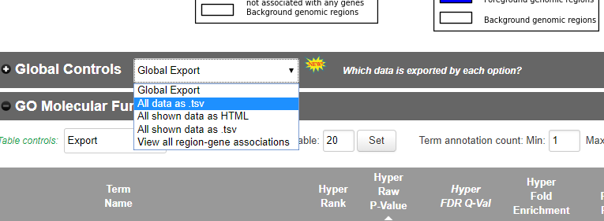

# Overview of GeneSetCluster

This is the demonstration of the R package GeneSetCluster

This is a package meant to be used to cluster together Gene-Sets from
pathway tools such as Ingenuity Pathway Aanalysis (IPA)
(<https://www.qiagenbioinformatics.com/products/ingenuity-pathway-analysis/>)
and GREAT (<http://great.stanford.edu/public/html/index.php>), GSEA
(<http://software.broadinstitute.org/gsea/index.jsp>) and others.
Gene-Sets often appear significant when running such tools with
different labels displaying different Gene-Sets.

Sometimes, interpreting the output is difficult, which can be made worse
whenof several gene sets analysis are compared.

The output data has several limitations:

1)  Low ratio: where there are only a few genes enriched.

2)  High similarity: where the different genes sets that appear have the
    same genes enriched despite the different labels.

3)  Low overlap: where the same gene set labels appear in different
    experimental settings but different genes are enriched.

Consequently, it is preferable to review the gene set analysis
experiment as a whole instead of investigating the many different
Gene-Sets individually. Furthermore, analysing multiple gene set
analysis is also improved by combining the different experiments. This
package does this by taking the sets of genes of every Gene-Set and
calculates the distance between them. By default this package uses a
relative risk, the higher it is the greater overlap they have. This
distance score is then used to cluster the Gene-Sets together.

Example data is taken from
<https://www.ncbi.nlm.nih.gov/geo/query/acc.cgi?acc=GSE111385>

Data has been analysed with Deseq2 pipeline where the data is
Transcriptome sequencing of WT and conditional-Tgfbr2 knockout microglia
and CNS-repopulating monocyte-derived macrophages from C57BL/6 mouse in
triplicates. The genes were picked in a comparison of uG vs Mac in both
WT and KO with a 1E-06 pvalue cutoff. Genes were analysed in both IPA
with the Canonical pathways and functional annotations were exported
into a excel file with default settings. Bed files were also generated
for the genes, and uploaded in GREAT with a background of the sequencing
samples. All data was exported in tsv format.


## Pipeline


# Harmonization, loading the data

Core to the pipeline is the PathwayObject. This can be generated using
the automatic loader (LoadGeneSets) or with ObjectCreator. ObjectCreator
needs just a vector of Gene-Sets labels, a vector with genes (as a
string for each Gene-Set), a vector with each group every Gene-Set
belongs to (e.g. KO or WT), it needs the Source (e.g. IPA), it needs the
Type (e.g. Canonical pathways), structure (e.g. SYMBOL), and seperator
(sep) (How is are the strings of the genes seperated). Gene-Sets labels,
Genes and Groups need the same length. Everything else is just a single
string. See example below in 1.7.

The LoadGeneSets function has all this automated, currently the
LoadGeneSets function supports both results exported in csv, excel or
tsv from webtools and R objects generated with the R implementations of
those tools. The Gene-Set Analysis that are supported for aumatic
loading are: GSEA, GREAT and IPA. Also in this new version have been
implemented a template to fill with the data and create the
PathwayObject automatically (for both exported csv or data frame
directly from R). In order to use any other analysis result.

Basically the features that will be integrated for each Gene-Set are: 
-   **Pathways:** name or identificator of the pathway. 
-   **Molecules:** identificator o name of the genes concatenated by a separator. 
-   **Group:** name of the group, experiment or análisis. 
-   **Source:** the gene set analysis approach used to generate the data. 
-   **Structure:** the key type of the genes. Either Symbol, EntrezID or EnsemblID.

## Loading GSEA data

Gene Set Enrichment Analysis (GSEA) is a computational tool used to
analyze gene expression data by comparing it with predefined sets of
genes, called gene sets. It ranks genes based on their expression
differences across experimental conditions and assesses whether members
of gene sets tend to occur higher or lower in the ranked list than
expected by chance. This method allows for the identification of
coordinated changes in the expression of functionally related genes,
providing insights into the biological pathways or processes associated
with a particular experimental condition. GSEA is particularly valuable
for studying complex biological systems, enabling researchers to uncover
relevant pathways even when individual gene expression changes are
subtle.

The GSEA data can be laoded either from and exported csv or R Object.
For now, GeneSetCluster only supports ClusterProfiler gseaResult
Objects.

These data that we will use as an example throughout the vignette come from the GSE198256 study (Brauns et al., 2022; DOI: 10.1172/jci.insight.154183). In which there are patients with acute infection, 3 months-post infection and 6 months post-infection, as well as controls. A differential gene expression analysis has been performed for each group vs. control, and with the results a GSEA has been performed. 

```{r loading GeneSetCluster}
library(GeneSetCluster)
```

```{r GSEA load, warning=FALSE}
# Loading from GSEA results files:
GSEA.files <- c(system.file("extdata", "Covid19AI_Healthy_GSEA.csv",
                            package = "GeneSetCluster"),
               system.file("extdata", "Covid193Mo_Healthy_GSEA.csv",
                            package = "GeneSetCluster"),
               system.file("extdata", "Covid196Mo_Healthy_GSEA.csv",
                            package = "GeneSetCluster"))

GSEA.Object1 <- LoadGeneSets(file_location = GSEA.files,
                             groupnames= c("IA", "Mo3", "Mo6"),
                             P.cutoff = 0.05,
                             Mol.cutoff = 5,
                             Source = "GSEA",
                             Great.Background = FALSE,
                             type = NA,
                             topranks = NA,
                             structure = "ENTREZID",
                             Organism = "org.Hs.eg.db",
                             seperator = "/")
```

## Loading GREAT data

Genomic Regions Enrichment of Annotations (GREAT) is a computational
tool used in genomics to understand the biological significance of sets
of genomic regions. It works by associating genomic regions, such as
those identified by genome-wide experiments like ChIP-seq or RNA-seq,
with biological annotations such as gene sets, regulatory elements, or
functional pathways. GREAT assesses whether the input genomic regions
are enriched for these annotations more than expected by chance,
providing insights into the potential biological functions and
regulatory mechanisms associated with the regions of interest. This
enrichment analysis helps researchers interpret their genomic data in
the context of known biological knowledge.

While exporting the data from GREAT or IPA the data is not filtered,
there for the loader filters the data. It needs a Pvalue cutoff. In IPA
the pvalue in Canonical Pathways is given as a -log10 pvalue, if the
P.cutoff is larger than 1 the loader assumes that the pvalues are -log10
transformed. The minimum number of genes (or molecules) per Gene-Set
(Recommended \>= 5), the data source. If GREAT was run the program needs
to know wether GREAT was run with a background. The type of data
(Canonical Pathways, Functional analysis etc). for GREAT doens't matter
as it runs 18 diferent types that the loader automatically assigns.

The GREAT output is really really large, so the tool itself by default
displays the top 20 ranks, this can be emulated by using the topranks.
The structure e.g. SYMBOL, this is important as the combinePathways
check that all the data is in the same structure and convert if
neccesary, which is why it needs the Organism. Currently supported is
the org.Mm.eg.db and org.Hs.eg.db packages. Last but not least is the
seperator, for seperating the genes from the string.

The results from [GREAT web
tool](http://great.stanford.edu/public/html/) should be export as tsv
file, as is shown in the image below. 

Also the data can be loaded direclty from the output of
[rGREAT](https://www.bioconductor.org/packages/release/bioc/html/rGREAT.html)
R package. Loading directly the GreatObject.

```{r GREAT, warning=FALSE}
# Loading from exported csv
Great.files <- c(system.file("extdata", "MM10.GREAT.KO.uGvsMac.bed.tsv",
                              package = "GeneSetCluster"),
                  system.file("extdata", "MM10.GREAT.WT.uGvsMac.bed.tsv",
                              package = "GeneSetCluster"))
# Create the object
Great.Object1 <- LoadGeneSets(file_location = Great.files,
                              groupnames= c("KO", "WT"),
                              P.cutoff = 0.05,
                              Mol.cutoff = 10,
                              Source = "Great",
                              Great.Background = FALSE,
                              type = "Canonical_Pathways",
                              topranks = 20,
                              structure = "SYMBOL",
                              Organism = "org.Mm.eg.db",
                              seperator = ",")
```


Recommended is to inspect the labels, if there are multiple experiments
the labels can be compared.

For investigate the metafiles check the experiment data and the metainfo
to make sure that the PathwayObject matches your experiment(s).

```{r Great with Background meta }
ShowExperimentdata(Object =Great.Object1)
ShowMeta(Object = Great.Object1)
```

Following loading of the PathwayObject the distance can be calculated in
the combinePathway function. If the data is very large, data can be
managed by selecting for types of interest using ManageGeneSets. In this
example we are interested in Disease Ontology and Go Biological Process,
so we ManageGeneSets to keep those data types and remove the others. The
result of the ManageGeneSets we can see using ShowExperimentdata and
ShowMeta.

```{r Great with Background manage clusters, warning=FALSE}
man.Great.Object1 <- ManageGeneSets(Object = Great.Object1, keep.type =c("Disease Ontology","GO Biological Process" ), exclude.type="")


ShowExperimentdata(Object =man.Great.Object1 )
ShowMeta(Object =man.Great.Object1 )
```

## Loading IPA data

IPA is a web-based bioinformatics platform designed for the analysis of
high-throughput experimental data, encompassing microarray and
next-generation sequencing results. It facilitates functional analysis,
integration, and deeper comprehension of data generated from various
sources, including gene expression, miRNA, SNP, metabolomics, and
proteomics studies. Users can upload their datasets for analysis,
allowing for the examination of gene lists, chemicals, or other
entities. IPA provides a search function for genes, proteins, chemicals,
and drugs, alongside interactive tools for constructing biological
networks that represent intricate biological systems.

The results of [IPA webtool](https://www.qiagenbioinformatics.com/products/ingenuity-pathway-analysis/)
should be exported as excel the Canonical pathways or Functional annotations, 
as it is shown in the image below. 

```{r load IPA, warning=FALSE}
IPA.files <- c(system.file("extdata", "MM10.IPA.KO.uGvsMac.Canonical_pathways.xls", package = "GeneSetCluster"),
                 system.file("extdata", "MM10.IPA.WT.uGvsMac.Canonical_pathways.xls", package = "GeneSetCluster"),
                 system.file("extdata", "MM10.IPA.KO.uGvsMac.Functional_annotations.xls", package = "GeneSetCluster"),
                 system.file("extdata", "MM10.IPA.WT.uGvsMac.Functional_annotations.xls", package = "GeneSetCluster"))
canonical.files <- IPA.files[grep("Canonical", IPA.files)] # interested in canonical files

IPA.object1 <- LoadGeneSets(file_location = canonical.files,
                          groupnames= c("KO", "WT"),
                          P.cutoff = 1.3,
                          Mol.cutoff = 5,
                          Source = "IPA",
                          type = "Canonical_Pathways",
                          structure = "SYMBOL",
                          seperator = ",",
                          Organism = "org.Mm.eg.db")
```


# Distance calculation, combining the gene-sets
Following all the setup of the pathwayObject we can now combine and cluster the Gene-Sets. The CombineGeneSets function calculates the distance between Gene-Sets which is further used for clustering and seriation-based (cluster-independent) approach.

The distances are calculated for two approaches considering Unique Gene-sets and considering Unique Pathways. Automatically CombineGeneSets will calculate the distances for both options. The result matrix for unique Gene-set will be stored in Data.RR slot and unique Pathway in DataPathways.RR slot. 

Briefly: In Gene Set Analysis (GSA), gene sets often overlap, causing redundancy and bias in cluster interpretation.

The updated GeneSetCluster package addresses this with the "Unique Pathway" method, which treats gene sets with the same label as unique by combining their genes. This eliminates duplication, streamlines the analysis, and clarifies gene set distinctions. As a result, comparisons between studies are easier, and biological interpretations are more accurate, helping researchers identify key pathways and genes more precisely.

    uniquePathway = FALSE: This option considers gene sets as they are, including any duplicates. This approach maintains the original structure of the gene sets without combining overlapping genes.

    uniquePathway = TRUE: This option treats gene sets with the same label as unique by combining their genes. This eliminates duplication, streamlines the analysis, and clarifies gene set distinctions.

These options allow researchers to choose between maintaining the original gene set structure or simplifying the analysis by eliminating redundancies. The threads parameter indicates the number of cores to use in order to parallelize.

```{r CombineGeneSets, warning=FALSE}
GSEA.Object2 <- CombineGeneSets(Object = GSEA.Object1, threads=2)
print(GSEA.Object2)
```

# Clustering 
The main idea of GeneSetCluster is grouping the different Gene-sets based on their similarity or distance.

There are two clustering approaches: classic (or cluster-dependent) approach and seriation-based (or cluster-independent) approach. The main differences between them is that in the classic approach must be specified the number of cluster to obtain. 

## Classic or cluster-dependent approach
We can apply clustering (kmeans or hierarchical clustering) approaches to group pathways based on distance values. As in this approach we must specified the number of clusters to generate, firstly we need to know the optimal number of clusters to know how many clusters to generate.

As mentioned above, we calculated the distances for two approaches considering unique Gene-sets or unique Pathways, with the parameter uniquePathway.

```{r optimalGeneSets, warning=FALSE}
OptimalGeneSets(Object = GSEA.Object2, uniquePathways=FALSE ,method = "silhouette", max_cluster= 24, cluster_method = "kmeans", main= "Kmeans for 24 clusters")

OptimalGeneSets(Object = GSEA.Object2, uniquePathways=TRUE ,method = "silhouette", max_cluster= 24, cluster_method = "kmeans", main= "Kmeans for 24 clusters")
```

We can see that even in the Gene-set unique approach (uniquePathway=FALSE) the optimal number of clusters is 3 we also obtain a high average silhoutte value when we generate 5 clusters. Indeed 5 is the optimal number of clusters in Pathway unique (uniquePathway=TRUE) approach. Therefore we're going to generate 5 clusters. 

Once that the clusters are generated the functional annotation will be performed using the Gene-sets that make up the clusters. Overrepresentation analysis (ORA) using all the genes in a cluster and in the case of having GO terms a semantic enrichment will be performe.

```{r ClusterGeneSets, warning=FALSE}
GSEA.Object3 <- ClusterGeneSets(Object = GSEA.Object2,
                                clusters = 5,
                                method = "kmeans")
```


Once the clusters are generated we can plot the heatmap to see the result. We can include the functional annotation with the arguments **doORA** and **wordcloud** to show the ORA of the genes that compose each cluster and the semantic enrichment (only when using GO terms), respectively. 

First, we will plot the data considering all gene sets as unique. This means that if different datasets are enriched in the same pathway (with the same ID), they will still be treated as distinct. For that set uniquePathways argument as FALSE. 

```{r plotGeneSets1, warning=FALSE, fig.height=10, fig.width=18}
p <- PlotGeneSets(Object = GSEA.Object3, uniquePathways = FALSE, 
                  doORA = TRUE, wordcloud = TRUE)
```

From the heatmap, we observe that clusters 2, 3, 4, and 5 contain gene sets with high similarity values, indicating closely related gene sets. In contrast, cluster 1 contains gene sets with low similarity values.
Despite this, we notice that cluster 1 can be further divided into two or three subclusters. To achieve this, we will use the **BreakUpCluster** method.
While it is apparent in this case, we can also use the **optimalGeneSets** function to determine the optimal number of subclusters for cluster 1. For that note that we are specifying for the cluster we want to break up.

```{r optimalGeneSets for BreakUpCluster, warning=FALSE}
OptimalGeneSets(Object = GSEA.Object3, uniquePathways=FALSE , cluster = 1, method = "silhouette", max_cluster= 24, cluster_method = "kmeans", main= "Kmeans for 24 clusters")
```

Now we are going to divide cluster 1 into 3 subclusters. We need to specify the cluster we want to break up in the breakup.cluster argument, and in how many clusters we want to split it. 

```{r PlotGeneSets after BreakUpCluster1, warning=FALSE, fig.height=10, fig.width=18}
GSEA.Object3.1 <- BreakUpCluster(Object = GSEA.Object3, uniquePathways = FALSE, 
                                 breakup.cluster = 1, sub.cluster = 3)

p <- PlotGeneSets(Object = GSEA.Object3.1, uniquePathways = FALSE, 
                  doORA = TRUE, wordcloud = TRUE)
```

In this new heatmap, we see that the old cluster 1 has been separated into 3 different clusters. This improves the clustering, as cluster 1 now consists of 3 subclusters, with 2 of them (1.1 and 1.2) showing high similarity. Indeed, this new two subcluster could biologically relevant or informative. If desired, we could further subcluster 1.3 into more subclusters using the same steps.


Now, we will plot the same dataset while treating pathways as unique. This means gene sets enriched in the same pathway (with the same ID) will be combined by merging their constituent genes. In this way, we will eliminate repeated pathways.
```{r PlotGeneSets after BreakUpCluster2, warning=FALSE, fig.height=10, fig.width=18}
p <- PlotGeneSets(Object = GSEA.Object3.1, uniquePathways = TRUE, 
                  doORA = TRUE, wordcloud = TRUE)
```

In the following scenario, we encounter an extreme case where the optimal solution suggests subclustering into 21 clusters. However, such granularity may not be practical. Therefore, we will select a smaller yet appropriate number of clusters. For example 6 subclusters.

```{r optimalGeneSets for BreakUpCluster2, warning=FALSE}
OptimalGeneSets(Object = GSEA.Object3.1, uniquePathways=TRUE , cluster=2, method="silhouette", max_cluster=24, cluster_method="kmeans", main="Kmeans for 24 clusters")
```

```{r PlotGeneSets after BreakUpCluster3, warning=FALSE, fig.height=10, fig.width=18}
GSEA.Object3.2 <- BreakUpCluster(Object = GSEA.Object3.1, uniquePathways = TRUE,
                                 breakup.cluster = 2, sub.cluster = 6)

p <- PlotGeneSets(Object = GSEA.Object3.2, uniquePathways = TRUE, 
                  doORA = TRUE, wordcloud = TRUE)
```

Thus, we've derived five new subclusters (2.2, 2.3, 2.4, 2.5, 2.6) with considerable similarity.

## Seriation-based or cluster-independent approach

Classic or cluster-dependent approaches, such as k-means or hierarchical clustering, have several limitations. They require specifying the number of clusters beforehand, which can lead to suboptimal grouping and inclusion of dissimilar gene sets within the same cluster, reducing biological relevance. These methods are sensitive to outliers, can miss subtle relationships, and often result in overfitting, capturing noise rather than meaningful groups.

To address these limitations, we can use seriation-based or cluster-independent approach. The seriation-based clustering method utilizes different seriation algorithms to group gene sets by similarities, avoiding forcing all gene sets into clusters. The selected seriation method is determined by calculating a score based on loss functions to select the most suitable one for each case.

If we want to use a specific seriation method, it can be specified with the **use_method** argument. To functionally annotate only the largest clusters, we need to set a minimum number of gene sets required to form a cluster. This avoids annotating very small clusters. There is an automatic way to determine the optimal minimum number based on our dataset, but it can also be set manually using **nPathways** argument.

So we will run the seriation-based approach.

```{r ClusterIndependentGeneSet1, warning=FALSE}
GSEA.Object3.2 <- ClusterIndependentGeneSet(Object = GSEA.Object3.2,
                                            use_method = NULL, nPathways = "optimal")
```

Now we plot it using **PlotPathwayCluster** method, where as in the PlotGeneSets, we have to specify if we want to use the unique GeneSets or unique Pathway apporach, and the functional annotation to show. 

```{r PlotPathwayCluster1, warning=FALSE}
p <- PlotPathwayCluster(GSEA.Object3.2, uniquePathways = FALSE, 
                        doORA = TRUE, wordcloud = TRUE)
```

We can see that the selected seriation method arranges the distance matrix into clusters with high similarity. While the largest clusters are easily noted, some medium-sized ones may be more relevant. To annotate these, we can adjust the minimum number of gene sets needed to form a cluster using the **SetPathway** method.

```{r optimal number, warning=FALSE}
paste0("Optimal minimum number of GeneSets to form a Cluster considering unique Gene-sets: ", GSEA.Object3.2@plot$aka3Independent$optimalNumberPathway)
paste0("Optimal minimum number of GeneSets to form a Cluster considering unique Pathways: ", GSEA.Object3.2@plot$aka3IndependentUnique$optimalNumberPathway)
```

Initially, we observe that the optimal minimum number for forming clusters is 8 when considering both unique gene sets and unique pathways. It's important to note that since different matrices are used for each approach, the optimal number may vary.

So we're going to set the minimum number of Genesets in 6 to annotate those clusters that are smaller. And plot it

```{r ClusterIndependentGeneSet after SetPathway, warning=FALSE, fig.height=10, fig.width=18}
GSEA.Object3.2min6 <- SetPathway(GSEA.Object3.2, nPathways = 6)
p <- PlotPathwayCluster(GSEA.Object3.2min6, uniquePathways = FALSE, 
                        doORA = TRUE, wordcloud = TRUE)
```

In this new results instead of having 5 clusters, we have 10, including smaller ones that we functionally annotated. These smaller clusters could be helpful and biologically meaningful.

Now we're going to explore the results considering unique Pathways and setting the minimum number of Pathways to 6.

```{r PlotPathwayCluster2, warning=FALSE, fig.height=10, fig.width=18}
p <- PlotPathwayCluster(GSEA.Object3.2, uniquePathways = TRUE, 
                        doORA = TRUE, wordcloud = TRUE)

p <- PlotPathwayCluster(GSEA.Object3.2min6, uniquePathways = TRUE, 
                        doORA = TRUE, wordcloud = TRUE)
```


It is worth to mention that is posible to access to all the ORA and GO terms results of each cluster. In case we would like to explore them mor ein detail.

```{r accessing , warning=FALSE}
head(GSEA.Object3.2@functionalAnnot$Geneset$ORA[[1]]) # each slot of the list refers to each cluster
head(GSEA.Object3.2@functionalAnnot$Geneset$GO[[1]]) # each slot of the list refers to each cluster
```


# Additional features

GeneSetCluster 2.0 has some additional functionalities that may be of interest to further explore our Gene-sets.

## Network visualization
Using the **PlotGeneNetworks** method on the PathwayObject plots a network. Plotting the network shows the relationship of Gene set with other gene sets in context with the minimum number of distance between them.

We need to specify if we want to plot the unique Gene-set or unique Pathway approach, and also which clustering method either classic or seriation-based. We specify the minimum distance between the genest with the parameter RRmin, that goes from 0 to 1.  


```{r PlotGeneNetworks1, warning=FALSE}
PlotGeneNetworks(GSEA.Object3, uniquePathways = TRUE, clusterIndependent = FALSE,
             labels = FALSE, RRmin = 0.1)
```

We can see how the Gene-sets within the same cluster are grouped and connected in the network. Increasing the value of RRmin makes us stricter with the minimum distance that two Gene-Sets must have to be connected. For example we will use a RRmin of 0.5.

```{r PlotGeneNetworks2, warning=FALSE}
PlotGeneNetworks(GSEA.Object3.2, uniquePathways = TRUE, clusterIndependent = FALSE,
             labels = FALSE, RRmin = 0.5)
```

These results are consistent with those we saw when plotting the heatmap with the classic or cluster-dependent approach (Gene-set unique).

Now we plot the seriation-based or cluster-independent approach. And increasing the RRmin.

```{r PlotGeneNetworks3, warning=FALSE}
PlotGeneNetworks(GSEA.Object3.2, uniquePathways = TRUE, clusterIndependent = TRUE,
             labels = FALSE, RRmin = 0.75)
```

## Extracting genes from clusters
GeneSetCluster allows the option to extract genes belonging to clusters. Again we must take into account whether we want the genes considering unique GeneSets or Pathways and the type of clustering. 

```{r GenesPerGeneSet, warning=FALSE}
head(GenesPerGeneSet(Object = GSEA.Object3.2, uniquePathways = FALSE, clusterIndependent = FALSE))
head(GenesPerGeneSet(Object = GSEA.Object3.2, uniquePathways = TRUE, clusterIndependent = TRUE))

```


## Tissue enrichment analysis
Using the TissueExpressionPerGeneSet function, we can see which tissues the genes in each cluster are enriched in, based on data from the Genotype-Tissue Expression (GTEx) database. Note: this step can take a long time. In total there are 54 tissues. 

We can wither specified the specific tissues we want to study or choose all of them. Also GeneSetCluster connects to an API to obtain the data, but also there is the possibility to run the analysis locally downloading the database.

Link of the database: ADD LINK!!!!!!!!!!!!!!!!!!!!!!!!!!!!!!!!!!!!!!!!!!!!!!!!!!

When we run the method we need to specify to do the enrichment either in the data where we perform classic (clusterIndependent = FALSE) or seriation-based clustering (clusterIndependent = TRUE). 

```{r TissueExpressionPerGeneSet, warning=FALSE}
GSEA.Object3.2 <- TissueExpressionPerGeneSet(Object=GSEA.Object3.2, clusterIndependent = TRUE, tissues = c("Lung", "Nerve...Tibial", "Whole.Blood", "Liver", "Brain...Amygdala", "Breast...Mammary.Tissue", "Heart...Atrial.Appendage", "Stomach", "Thyroid"))     
```

We will plot it using **PlotTissueExpression** method. 

```{r PlotTissueExpression1, warning=FALSE, fig.width=8}
PlotTissueExpression(GSEA.Object3.2, clusterIndependent = T, uniquePathways = T) 
```

In this plot, we can see the number of genes in each cluster, how enriched each cluster is in the selected tissues, and the total sum of all clusters for each tissue.

We also have an argument to show us the Z-scores so that we can visualize it in a better way, in the cases that we are enriching in many genes. 

```{r PlotTissueExpression2, warning=FALSE, fig.width=8}
PlotTissueExpression(GSEA.Object3.2, clusterIndependent = T, uniquePathways = T, showZscore = TRUE) 
```

## STRINGdb analysis
STRINGdb is a comprehensive database providing crucial information on protein-protein interactions, which aids in understanding the functional relationships within the proteome. GeneSetCluster uses STRINGdb plugin to analyse our GeneSets. 

Firstly, we will perform the protein-protein interaction analysis. Again we must take into account whether we want the genes considering unique GeneSets or Pathways and the type of clustering.

```{r GetSTRINGdbPerGeneSets, warning=FALSE}
GSEA.Object3.2 <- GetSTRINGdbPerGeneSets(GSEA.Object3.2, clusterIndependent = T, uniquePathways = T) 
```

For plotting we need to specify the cluster we want to plot. 

```{r plotSTRINGdbPerGeneSets, warning=FALSE}
plotSTRINGdbPerGeneSets(GSEA.Object3.2, plot.cluster = 4) 
```
